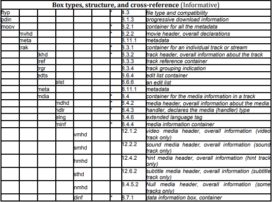
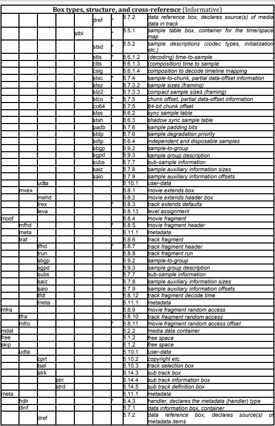
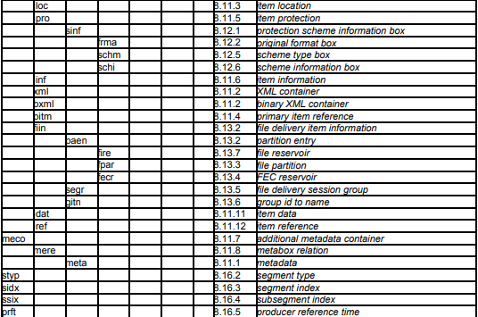

# MP4 Study
A simple code to hopefully render fome mp4 frames.
Below is just the doc of what i've got so far :)

## Basics
    * All the data are in format \[4bytes length, 4 bytes data type, {length} bytes data content] (mostly);
    * These "things" are called box or atoms.
    * mp4 files have (mostly) ftyp(filetype) data type. it again follows the same format above.
    * a box can contain other boxes within it. (apparently called container box. who cares)
    * main boxes that is useful are mdat box and moov box. 
### Box types Reference

